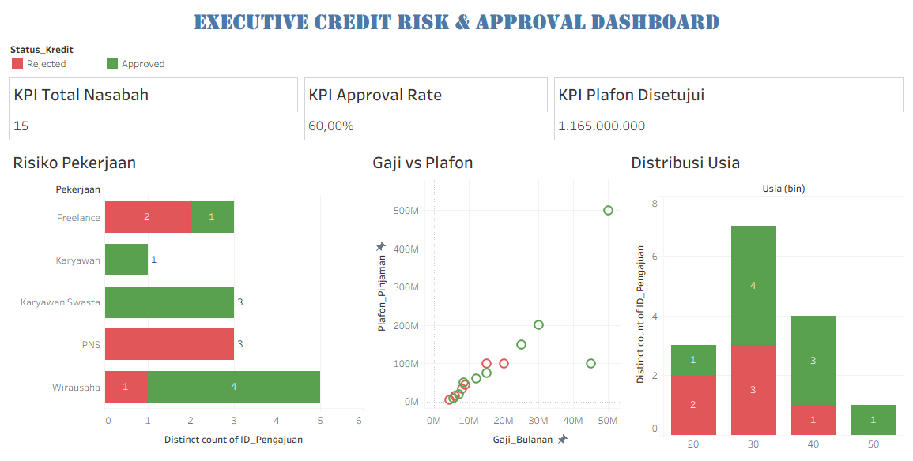

# 📈 Credit Risk Analysis & Approval Dashboard

*(Tampilan Interaktif Dashboard)*
 

---

## 📝 Latar Belakang Proyek
Proyek ini bertujuan untuk menganalisis dan memitigasi risiko dari data pengajuan kredit nasabah perbankan. Analisis ini difokuskan pada penemuan pola risiko berdasarkan demografi nasabah (usia dan pekerjaan) serta rasio finansial (gaji dan plafon pinjaman) guna membantu tim *Risk Management* merumuskan kebijakan persetujuan kredit yang lebih aman dan digerakkan oleh data (*data-driven*).

## 🗂️ Sumber Data
> **Catatan Portofolio:** Analisis ini menggunakan *dataset* pengajuan kredit yang pada awalnya berantakan (*dirty data*). Data tersebut memuat metrik seperti Gaji Bulanan, Plafon Pinjaman, Usia, Pekerjaan, dan Skor Kredit. Data telah melalui tahap *Data Cleaning* yang ekstrem (Imputasi *Missing Values*, perbaikan format mata uang/tanggal, dan pembersihan teks spasi) sebelum divisualisasikan.

## 🛠️ Tools yang Digunakan
* **Microsoft Excel:** *Data Cleaning, Data Imputation (Mean/Median), Standardisasi Format.*
* **Tableau Public:** *Data Visualization, Calculated Fields* (Pembuatan metrik *Approval Rate*), *Parameter Bins* (Distribusi Usia), dan *Dashboard Layouting*.

---

## 💡 Business Insights (Temuan Data)
Dari *dashboard* yang telah dibangun, ditemukan 4 pola utama terkait profil risiko nasabah:

1. **⚖️ Filter Risiko Ketat (Approval Rate):** Tingkat persetujuan kredit (*Approval Rate*) berada di angka **47,37%**. Hal ini mengindikasikan bahwa bank telah menerapkan filter kelayakan yang cukup ketat dalam menyaring profil nasabah.
   
2. **🏢 Profil Risiko Pekerjaan:** Kelompok profesi **PNS dan Freelance** menunjukkan tingkat penolakan (*Reject Rate*) yang paling tinggi. Sebaliknya, nasabah dengan profesi **Wirausaha** menjadi penyumbang persetujuan kredit (*Approved*) terbanyak, menjadikannya segmen yang paling sehat bulan ini.
   
3. **💰 Korelasi Gaji vs Plafon:** Terdapat korelasi positif antara pendapatan dan jumlah pinjaman. Namun, nasabah dengan gaji di bawah **Rp 20 Juta** yang mencoba meminjam plafon terlampau tinggi cenderung langsung masuk ke dalam kategori *Rejected* (merah).
   
4. **📊 Demografi Usia Berisiko:** Pasar terbesar peminjam berada pada rentang **usia 30-39 tahun**. Meskipun demikian, kelompok nasabah muda (usia **20-29 tahun**) menunjukkan rasio penolakan tertinggi dibandingkan demografi usia yang lebih matang.

---

## 🚀 Rekomendasi Tindakan (*Actionable Plan*)
* **Penyesuaian Batas Plafon (*Cap Limit*):** Terapkan aturan batas maksimal pinjaman yang lebih ketat atau penambahan syarat agunan untuk nasabah dengan rentang gaji di bawah Rp 20 Juta guna menekan angka gagal bayar.
* **Fokus Pemasaran Segmen Wirausaha:** Alokasikan anggaran *marketing* untuk membuat promo atau program bunga khusus yang menargetkan kelompok Wirausaha, mengingat kelompok ini memiliki rekam jejak persetujuan terbaik.
* **Verifikasi Ketat Usia Muda:** Terapkan proses *screening* atau verifikasi tambahan untuk pendaftar di usia awal 20-an, atau berikan batas tenor dan plafon awal yang lebih rendah untuk membangun skor kredit mereka secara bertahap.

---
**Author:**
Muhammad Al Gifari
