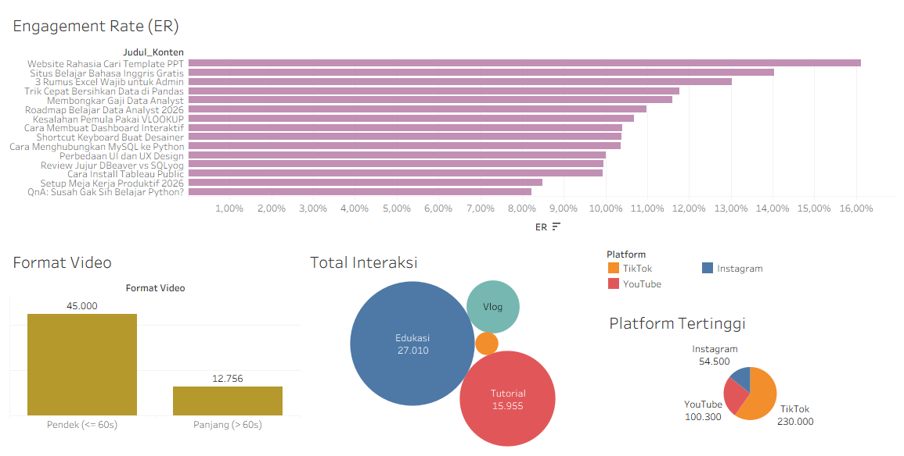

# 📈 Social Media Content Performance Analysis

*(Tampilan Interaktif Dashboard)*

---

## 📝 Latar Belakang Proyek
Proyek ini bertujuan untuk menganalisis performa 15 konten video edukasi di berbagai platform digital (TikTok, YouTube, dan Instagram) di bawah naungan *brand* Digital Journey. Analisis ini difokuskan pada penemuan pola interaksi audiens (*Engagement Rate*), efektivitas durasi video, dan dominasi platform guna merumuskan strategi *content marketing* bulan depan yang sepenuhnya digerakkan oleh data (*data-driven*).

## 🗂️ Sumber Data
> **Catatan Portofolio:** Analisis ini menggunakan *dataset* simulasi performa media sosial yang mencakup metrik *Views, Likes, Comments, Shares,* dan *Durasi* untuk mendemonstrasikan kemampuan *Data Storytelling* dan pembuatan metrik turunan.

## 🛠️ Tools yang Digunakan
* **Tableau Public:** *Data Visualization, Calculated Fields* (Pembuatan metrik *Engagement Rate*), dan *Dashboard Layouting*.

---

## 💡 Business Insights (Temuan Data)
Dari *dashboard* yang telah dibangun, ditemukan 3 pola utama terkait perilaku audiens:

1. **⏱️ Dominasi Video Pendek (*Short-form*):** Terdapat korelasi yang sangat kuat antara durasi di bawah 60 detik dengan lonjakan distribusi *Views*. Video pendek meraih rata-rata hingga **45.000 Views**, hampir 4 kali lipat lebih tinggi dibandingkan video panjang (*long-form*).
   
2. **🏆 Raja Engagement (Edukasi & Tools):** Konten kategori Edukasi, khususnya video dengan judul *"Website Rahasia Cari Template PPT"*, menghasilkan *Engagement Rate* (ER) tertinggi hingga **16%**. Audiens lebih cenderung berinteraksi (*Like, Comment, Share*) pada konten yang memberikan alat bantu praktis.
   
3. **📱 Fokus Platform:** **TikTok** secara mutlak mendominasi perolehan *reach* dengan total lebih dari **230.000 Views**, jauh melampaui YouTube dan Instagram dalam periode yang sama.

---

## 🚀 Rekomendasi Tindakan (*Actionable Plan*)
* **Pivot Format Konten:** Kurangi produksi video panjang. Pecah materi tutorial atau edukasi yang panjang menjadi seri video pendek berdurasi di bawah 60 detik untuk memaksimalkan jangkauan algoritma.
* **Fokus Distribusi:** Alokasikan 75% waktu, tenaga, dan anggaran pemasaran konten untuk optimasi di platform **TikTok**.
* **Perbanyak "Resource Sharing":** Replikasi kesuksesan video dengan ER tertinggi dengan cara rutin membuat konten yang membagikan *website* rahasia, *template* gratis, atau *shortcut* desain minimal seminggu sekali.
